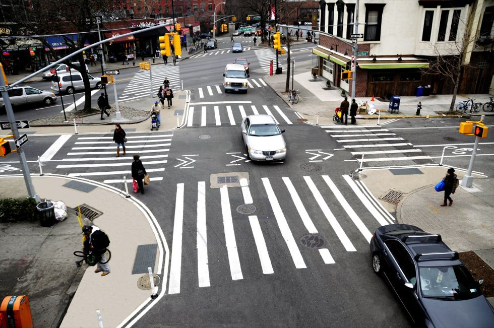
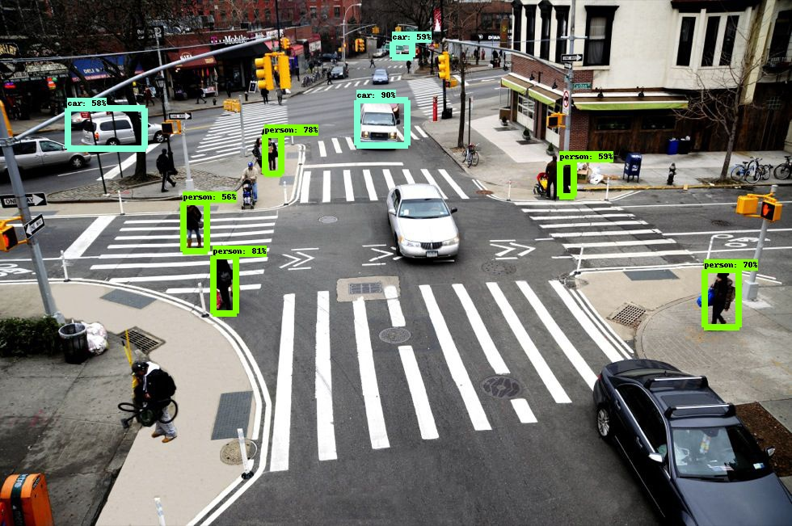
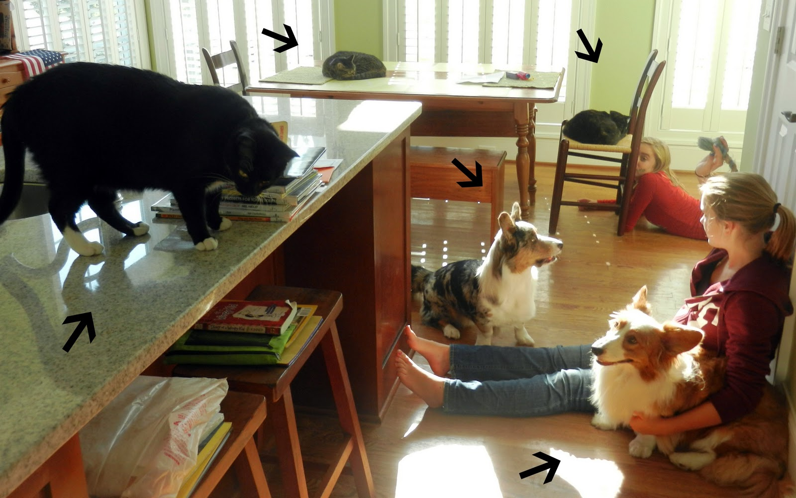
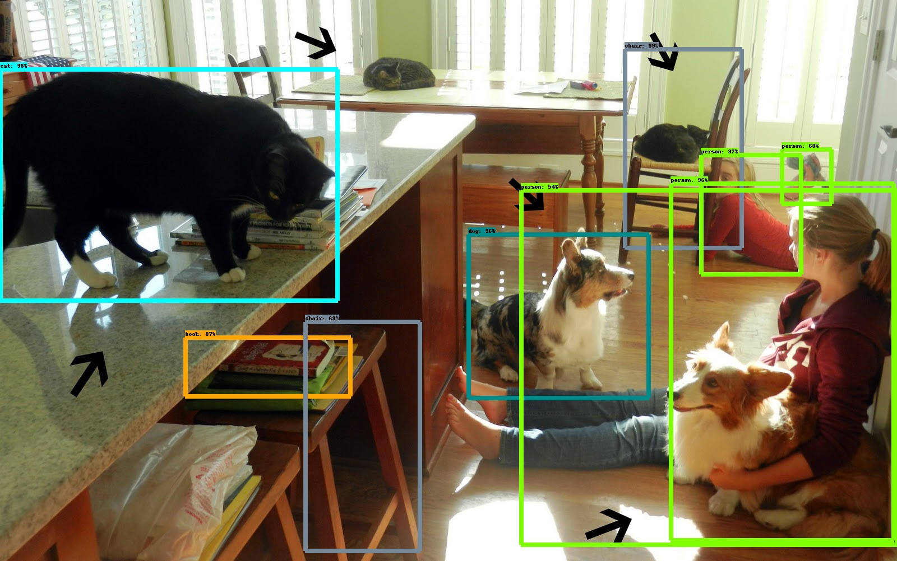
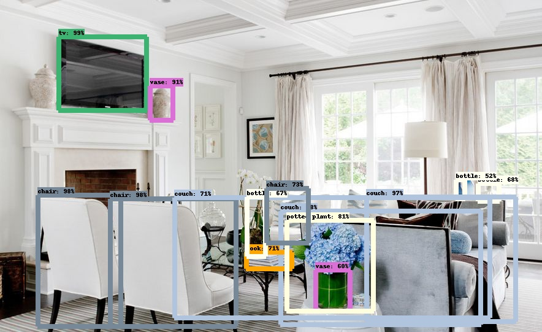
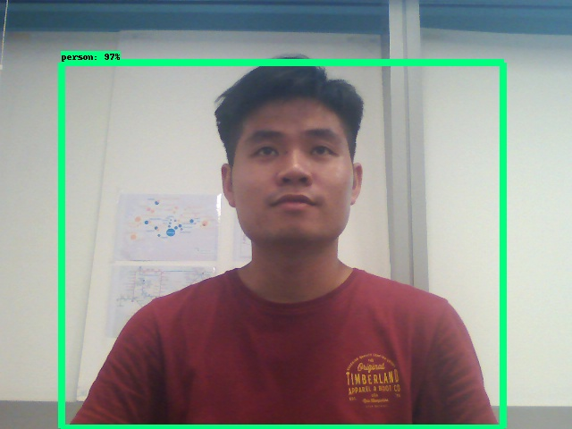

   # Annotating Images with TensorFlow Object Detection API 
   
   Felix Le Hong Phuoc 
   <br>March 2019

# Table of contents
I. [**Overview**](#overview)
1. [Problem Description](#problem_description)
2. [Tensorflow Object Detection API](#object_detection_api)
3. [Annotating Image](#annotating_image)
    
II. [**Preliminaries**](#preliminaries)
1. [Setting up working environment](#setup)
2. [Protobuf Installation](#protobuf)

III. [**Provisioning of the project code**](#provision)
1. [Class Initialization](#class_init) 
2. [Loading Model and Images ](#loading)
3. [Detection, Annotation and Visualization ](#detection)
4. [Pipelines](#pipeline)

IV. [**Results and Applications**](#result)
1. [Annotating images with file_pipeline.py ](#image)
2. [Annotating video with video_pipeline.py](#video)
3. [Annotating screenshot captured by webcam with webcam_pipeline.py](#webcam_screenshot)
4. [Real-time webcam detection ](#realtime_webcam)

V. [**Limitations & Recommendations**](#limitations)

VI. [**References**](#references)


# I. Overview <a name="overview"></a>
## 1.Problem Description <a name="problem_description"></a>

<div style="text-align: justify">
Computer vision has made great leaps forward in recent years because of deep learning, thus granting computers a higher grade in understanding visual scenes. The potentialities of deep learning in vision tasks are great: allowing a computer to visually perceive and understand its surrounding is a capability that opens the door to new artificial intelligence applications in mobility, manufacturing, healthcare and many other human-machine interaction contexts. For instance, self-driving cars can detect if an appearing obstacle is a pedestrian, an animal or another vehicle from the camera mounted on it and decide the correct course of action. Meanwhile, a robot with "seeing" capability can recognize surrounding objects and successfully interact with them.

This project presents a quick and handy way to make computer understand images and videos collected from the Internet or directly taken from webcam. The goal of this project is to find the exact location and the type of the objects in an image.

If you wish to skip the methodology and proceed straight to the results and applications, plese click [here](#result).

<div>
## 2. Tensorflow Object Detection API <a name="object_detection_api"></a>
<div style="text-align: justify">
In order to achieve such classification and localization, we wil leverage the TensorFlow object detection  API. This is a Google's open source frame work built on top of TensorFlow which is focused on finding objects in images (estimating the chance that an object is in this position) and their bounding boxes. The framework offers some useful functions and these five pre-trained different models:
    * Single Shot Multibox Detector (SSD) with MobileNets
    * SSD with Interception V2
    * Region-Based Fully Convolutional Networks (R-FCN) with Resnet 101
    * Faster R-CNN with Resnet 101
    * Faster R-CNN with Interception Resnet v2
The model are in growing order of precision in detection and slower speed of execution of the detection process. **MobileNets, Inception** and **Resnet** refer to different types of Convolution Neural Network (CNN) architecture. **Single Shot Multibox Detector (SSD), Region Based Fully convolutional networks (R-FCN)** and **Faster Regioartificialn-based convolutional neural network (Faster R-CNN)** are instead the different models to detect multiple objects in images. A source of reference with more details about these detection models can be found [here](https://towardsdatascience.com/deep-learning-for-object-detection-a-comprehensive-review-73930816d8d9).
<div>

## 3. Annotating Image <a name="annotating_image"></a>
<div style="text-align: justify">
* Given such a powerful tool made available by TensorFlow, our plan is to leverage its API by creating a class you can use for annotating images both visually and in an external file. By annotating we mean the following:
    - Pointing out the objects in an image 
    - Reporting the level of confidence in the object recognition (only consider objects above a minimum probability threshold, which is set at 0.25)
    - Outputting the coordinates of two opposite vertices of the bounding box for each image
    - Saving all such information in a text file in JSON format
    - Visually representing the bounding box on the original image, if required<br/>
    
    
* In order to achieve such objectives, we need to:
    1. Download one of pre-trained models (available in .pb format - protobuf) and make it available in-memory as a TensorFlow session
    2. Reformulate the helper code provided by TensorFlow in order to make it easier to load labels, categories and visualization tools
    3. Prepare a simpleProvisioning of the project code script sto demonstrate its uage with single images, videos and videos captured from a webcam
find
Let's first start by seeting up an environment suitable for the project.
<div>


# II. Preliminaries <a name="preliminaries"></a>
## 1. Setting up working environment  <a name ="setup"></a>
For this project, a separated environment named *TensorFlow_api* is created using Anaconda *conda*. The commands in terminal are as follows: 


```shell
conda create -n TensorFlow_api_2 python=3.5 numpy pillow requests pyparsing
source activate TensorFlow_api_2
```

After activating the environment, we install the necessary packages using *conda install*:

```shell
conda install TensorFlow-gpu
conda install -c menpo opencv
conda install -c conda-forge imageio
conda install tqdm
conda install -c conda-forge moviepy
```

In case you prefer another way of running this project, please make sure that you have *numpy, pillow, requests, pyparsing, TensorFlow, opencv, imageio, tqdm* and *moviepy* packages in order to run it successfully. Below is the information about system and packages that we use in this project:
* Operating System: Ubuntu 16.04 (it is possible to run in Window as well)
* Python v3.5.6
* TensorFlow v1.5.0
* CUDA 10.0
* cuDNN v6.0

The next step is to download the the Tensor-FLow object detection API progject using Git


```shell
mkdir api_project
cd api_project
git init
git remote add -f origin https://github.com/tensorflow/models.git
git config core.sparseCheckout true
echo "research/object_detection/*" >> .git/info/sparse-checkout
git pull origin master 
```

The above command will checkout only the `object_detection` directory in the TensorFlow models project. It is required to put the project script in the very same directory of `object_detection` directory.

## 2. Protobuf Installation <a name="protobuf"></a>
<div style="text-align: justify">
The TensorFlow object detection API uses *protobufs*, protocol buffers -- Google's data interchange format (https://github.com/protocolbuffers/protobuf), to configure the models and their training parameters. Before the framework can be used, the protobuf libraries must be compiled which requires different steps in a Unix or Window OS environment.
<div>
### *Windows installation*:
First, unpack the `protoc-3.4.0-win32.zip` that can be found at https://github.com/protocolbuffers/protobuf/releases?after=v3.4.1 into the project folder. Then add the `protoc-3.4.0-win32.zip` directory to the system path, and execute the following command:

```shell
protoc-3.4.0-win32/bin/protoc.ext object_detection/protos/\*.proto --python_out=.
```

### *Unix Installation*

For Unix environments, the installation procedure can be done using shell command as described in the following instruction: https://github.com/tensorflow/models/blob/master/research/object_detection/g3doc/installation.md


# III. Provisioning of the project code <a name="provision"></a>
## 1. Class Initialization <a name="class_init"></a>

We start scripting our project in the file `tensorflow_detection.py` by loading the necessary package:


```python

import os
import numpy as np
import tensorflow as tf
import six.moves.urllib as urllib
import tarfile
from PIL import Image
from tqdm import tqdm
from time import gmtime, strftime
import json
import cv2

try:
    from moviepy.editor import VideoFileClip
except:
    # If FFmpeg (https://www.ffmpeg.org/) is not found on the computer
    # it will be downloaded from Internet(an internet connection is needed)
    import imageio
    imageio.plugins.ffmpeg.download()
    from moviepy.editor import VideoFileClip

from IPython.display import Image
from object_detection.utils import label_map_util
from object_detection.utils import visualization_utils as vis_util

```


    ---------------------------------------------------------------------------

    ModuleNotFoundError                       Traceback (most recent call last)

    <ipython-input-5-3ec01baab5c2> in <module>()
          2 import os
          3 import numpy as np
    ----> 4 import tensorflow as tf
          5 import six.moves.urllib as urllib
          6 import tarfile


    ModuleNotFoundError: No module named 'tensorflow'


<div style="text-align: justify">
We define the `DetectionObj` class and its `init` procedure. The initialization expects only a parameter and the model name, but a few internal parameters can be changed to suit the use of the class:
* **self.TARGET_PATH** pointing out the directory where the processed annotation will be saved
* **self.THRESHOLD** fixing the probability threshold that will be noticed by the annotation processed. Any detection with confidence level less than this threshold will be ignored.
<div>


```python

class DetectionObj(object):
    """
    Detection object is a class suitlable to leverage Google Tensorflow
    detection API for image annotation from different sources:
    files, images acquired by own's webcam, videos
    """
    def __init__(self, model='ssd_mobilenet_v1_coco_11_06_2017'):
        """
        The instructions to be run when the class is instantiated
        """
        # Path where the Python script is being run
        self.CURRENT_PATH = os.getcwd()
        # Path where to save the annotation
        self.TARGET_PATH = self.CURRENT_PATH

        # Selection of pre-trained detection models
        # from the Tensorflow Model Zoo ( 5 typical models for image recognition)
        self.MODELS = ["ssd_mobilenet_v1_coco_11_06_2017",
                       "ssd_inception_v2_coco_11_06_2017",
                       "rfcn_resnet101_coco_11_06_2017",
                       "faster_rcnn_resnet101_coco_11_06",
                       "faster_rcnn_inception_resnet_v2_atrous_coco_11_06_2017"]
        # Setting a threshold for detecting an object by the models
        self.THRESHOLD = 0.25 # Most used threshold in practice

        # Checking if the desired pre-trained detection model is available
        if model in self.MODELS:
            self.MODEL_NAME = model
        else:
            # Otherwise revert to a default model
            print("Model not available, reverted to default", self.MODELS[0])
            self.MODEL_NAME = self.MODELS[0]

        # The file name of the Tensorflow frozen model
        self.CKPT_FILE = os.path.join(self.CURRENT_PATH, 'object_detection',
                                      self.MODEL_NAME, 'frozen_inference_graph.pb')

        # Attemping loading the detection model, if not available on disk,
        # it will be downloaded from Internet (an Internet connection is required)
        try:
            self.DETECTION_GRAPH = self.load_frozen_model()
        except:
            print('Couldn\'t find', self.MODEL_NAME)
            self.download_frozen_model()
            self.DETECTION_GRAPH = self.load_frozen_model()

        # Loading the labels of the classes recognized by the detection model
        self.NUM_CLASSES = 90
        path_to_labels = os.path.join(self.CURRENT_PATH, 'object_detection', 'data', 'mscoco_label_map.pbtxt')
        label_mapping = label_map_util.load_labelmap(path_to_labels)
        extracted_categories = label_map_util.convert_label_map_to_categories(label_mapping, \
                                                                              max_num_classes=self.NUM_CLASSES, use_display_name=True)
        self.LABELS = {item['id']: item['name'] for item in extracted_categories}
        self.CATEGORY_INDEX = label_map_util.create_category_index(extracted_categories)

        # Starting the tensorflow session
        self.TF_SESSION = tf.Session(graph=self.DETECTION_GRAPH)
        
```

## 2. Loading Model and Images <a name="loading"></a>
The functions `load_frozen_model` and `download_frozen_model` will help the `init` procedure to load the chosen frozen model from the disk. If the model is not available locally, it will be downloaded as a TAR file and unzip the proper directory.


```python
    
    def load_frozen_model(self):
        """
        Loading frozen detection model in ckpt file from disk to memory
        """
        detection_graph = tf.Graph()
        with detection_graph.as_default():
            od_graph_def = tf.GraphDef()
            with tf.gfile.GFile(self.CKPT_FILE, 'rb') as fid:
                serialized_graph = fid.read()
                od_graph_def.ParseFromString(serialized_graph)
                tf.import_graph_def(od_graph_def, name='')
        return detection_graph


    def download_frozen_model(self):
        """
        Download frozen detection model from Internet
        when not available on disk
        """
        def my_hook(t):
            """
            Wrapping tqdm instance in order to monitor URLopener
            """
            last_b = [0]

            def inner(b=1, bsize=1, tsize=None):
                if tsize is not None:
                    t.total = tsize
                t.update((b - last_b[0])*bsize)
                last_b[0] = b
                
        
            return inner
        
        # Opening the url where to find the model
        model_filename = self.MODEL_NAME + '.tar.gz'
        download_url = 'http://download.tensorflow.org/models/object_detection/'
        opener = urllib.request.URLopener()

        # Downloading the model with tqdm estimation of completion
        print('Downloading ...')
        with tqdm() as t:
            opener.retrieve(download_url + model_filename, model_filename, reporthook=my_hook(t))

        # Extracting the model from the downloaded tar file
        print('Extracting ...')
        tar_file = tarfile.open(model_filename)
        for file in tar_file.getmembers():
            file_name = os.path.basename(file.name)
            if 'frozen_inference_graph.pb' in file_name:
                tar_file.extract(file, os.path.join(self.CURRENT_PATH, 'object_detection'))

```

The two following functions, `load_image_from_disk` and `load_image_into_numpy_array`, are necessary to pick an image from disk and transform it into a Numpy array suitable for being processed by any of the TensorFlow models available in this project:


```python
    
    def load_image_from_disk(self, image_path):
        """
        Loading an image from disk
        """
        return Image.open(image_path)

    def load_image_into_numpy_array(self, image):
        """
        Turning an image into a numpy ndrray
        """
        try:
            (im_width, im_height) = image.size
            return np.array(image.getdata()).reshape((im_height,im_width,3)).astype(np.uint8)
        except:
            # If the previous procedure fails, we expect the
            # image is already a Numpy ndarray
            return image
        
```

## 3. Detection, Annotation and Visualization <a name="detection"></a>
<div style="text-align: justify">
The `detect` function, instead, is the core of the classification functionality of the class. The function just expects lists of images to be processed. A Boolean flag, ***annotate_on_image***,  just tell the scripts to visualize the bounding box and the annotation directly on the provided images.
<br/>We then take a few tensors in the model by name (***detection_boxes, detection_scores, detection_classes, num_detections***), and feed everything to the input tensor, ***image_tensor***, which will normalize the image in a suitable form for the layers of the model to process.
<br>The results are gathered into a list and the images are processed with the detection boxes and represented if required:
<div>


```python
    
    def detect(self, images, annotate_on_image=True):
        """
        Processing a list of images, feeding it into the detection model
        and getting from its scores, bounding boxes and predicted classes present in the images
        """

        if type(images) is not list:
            images = [images]
        results = list()

        for image in images:
            # the array based representation of the image will be used later in order to
            # prepare the resulting
            image_np = self.load_image_into_numpy_array(image)
            # Expand dimensions since the model expects images to have shape [1,None,None,3]
            image_np_expanded = np.expand_dims(image_np, axis=0)
            image_tensor = self.DETECTION_GRAPH.get_tensor_by_name('image_tensor:0')
            # Each box represent a part of the image where a particular object was detected.
            boxes = self.DETECTION_GRAPH.get_tensor_by_name('detection_boxes:0')
            # Each score represent how level of confidence for each of the objects.
            # Score could be shown on the result image, together with the class label.
            scores = self.DETECTION_GRAPH.get_tensor_by_name('detection_scores:0')
            classes = self.DETECTION_GRAPH.get_tensor_by_name('detection_classes:0')
            num_detections = self.DETECTION_GRAPH.get_tensor_by_name('num_detections:0')

            # Actual detection happen here
            (boxes, scores, classes, num_detections) = self.TF_SESSION.run(
                             [boxes, scores, classes, num_detections],
                             feed_dict={image_tensor: image_np_expanded})

            if annotate_on_image: # Visualize the bounding box and the
                                  # annotation directly
                new_image = self.detection_on_image(image_np, boxes, scores, classes)
                results.append((new_image, boxes, scores, classes, num_detections))
            else:
                results.append((image_np, boxes, scores, classes, num_detections))

        return results

```

<div style="text-align: justify">
The function `detection_on_image` just processes the results from the `detect` function and returns a new image enriched by bounding boxes. This image can be represented on screen by the function `visualize_image`.  You can adjust the time an image will stay on screen by tuning the ***latency*** parameter:
<div>


```python
   
    def detection_on_image(self, image_np, boxes, scores, classes):
        """
        Overimposing detection boxes on the images over the detected classes:
        Process the results from the 'detect' function
        Return a new image enriched by bounding boxes which will be represented
        on screen by the function visualize_image
        """
        vis_util.visualize_boxes_and_labels_on_image_array(
            image_np,
            np.squeeze(boxes),
            np.squeeze(classes).astype(np.int32),
            np.squeeze(scores),
            self.CATEGORY_INDEX,
            use_normalized_coordinates=True,
            line_thickness=8)
        return image_np

    def visualize_image(self, image_np, image_size=(400,300), latency = 2, bluish_correction=True):
        """
        Visualizing an image
        """
        # Reduce the image_np to image_size
        height, width, depth = image_np.shape
        reshaper = height / float(image_size[0])
        width = int(width / reshaper)
        height = int(height / reshaper)
        id_img = 'preview' + str(np.sum(image_np))
        cv2.startWindowThread()
        cv2.namedWindow(id_img, cv2.WINDOW_NORMAL)
        cv2.resizeWindow(id_img, width, height)

        if bluish_correction: # bluish_correction: apply when image are offered in BGR format instead of RGB
            RGB_img = cv2.cvtColor(image_np, cv2.COLOR_BGR2RGB)
            cv2.imshow(id_img, RGB_img)
        else:
            cv2.imshow(id_img, image_np)
        cv2.waitKey(latency*1000) # Adjust Latency value, which correspond to the seconds the image
        # will stay on screen before the script passes to process another image
        
```

Annotations are prepared and written to disk by the ***serialize_annotations*** functions as follow:


```python
  
    def serialize_annotations(self, boxes, scores, classes, filename='data.json'):
        """
        Saving annotations to disk, on a JSON file
        """
        threshold = self.THRESHOLD
        valid = [position for position, score in enumerate(scores[0]) if score > threshold]
        # Only save annotations of those images that score greater than threshold (high confidence)
        if len(valid) > 0:
            valid_scores = scores[0][valid].tolist()
            valid_boxes = boxes[0][valid].tolist()
            valid_class = [self.LABELS[int(a_class)] for a_class in classes[0][valid]]

            with open(filename, 'w') as outfile:
                json_data = json.dumps({'classes': valid_class, 'boxes':valid_boxes, 'scores':valid_scores})
                json.dump(json_data, outfile)
                
```

The JSON points out the detected class, the level of confidence, and the vertices of the bounding box which are expressed as percentages the height and width of the image. For instance, this is the result from a detection on a dog's photo:

```json
{"classes": ["dog"],
"scores": [0.9092628359794617], 
"boxes": [[0.025611668825149536, 0.22220897674560547, 0.9930437803268433, 0.7734537720680237]]}
```

The function `get_time` conveniently transform the actual time into a string that can be used in a filename:


```python
  
    def get_time(self):
        """
        Returning a string reporting the actual date and time
        """
        return strftime("%Y-%m-%d_%Hh%Mm%Ss", gmtime())
    
```

## 4. Pipelines <a name="pipeline"></a>
<div style="text-align: justify">
Finally we prepare three pipielines, for images, videos and webcams. 
* ### For Images:<br/>   
The `file_pipeline` function compires all the steps necessary to load images from storage and visualize/annotate them:
    1. Load images from disk
    2. Apply object detection on the loaded images
    3. Writting the annotations for each image in JSON file
    4. If required by Boolean parameter ***visualize***, represent the images with its bounding boxes on the computer screen<div>


```python
   
    def file_pipeline(self, images, visualize=True, save=True, bluish_correction=True):
        '''
        A pipeline for processing and annotating lists of
        images to load from disk
        '''

        if type(images) is not list:
            images = [images]
        for filename in images:
            print(filename)
            single_image = self.load_image_from_disk(filename)
            for new_image, boxes, scores, classes, num_detections in self.detect(single_image):
                self.serialize_annotations(boxes, scores, classes, filename=filename + ".json")
                if visualize:
                    self.visualize_image(new_image)
                if save:
                    save_path = os.path.join(self.CURRENT_PATH, filename[:-4] + "_annotated.jpg")
                    print(save_path)
                    if bluish_correction:
                        new_image = cv2.cvtColor(new_image, cv2.COLOR_BGR2RGB)
                    cv2.imwrite(save_path, new_image)
                    
```

* ### For Videos:<br/>  
The 'video_pipeline' lets the `VideoFileClip` module from `moviepy` do all the heavy lifting after simply passing the `detect` function appropriately wrapped in the `annotate_photogram` function. After completing the operation, it generate a video with bounding box and save that video to disk:


```python

    def annotate_photogram(self, photogram):
        '''
        Annotating a video's photogram with bounding box
        over detected classes
        '''
        new_photogram, boxes, scores, classes, num_detections = self.detect(photogram)[0]
        return new_photogram

    def video_pipeline(self, video, audio=False):
        """
        A pipeline to process a video on disk and annotating it
        by bounding box. The output is a new annotated video
        """
        clip = VideoFileClip(video)
        new_video = video.split('/')
        new_video[-1] = "annotated_" + new_video[-1]
        new_video = '/'.join(new_video)
        print("Saving annotated video to", new_video)
        video_annotation = clip.fl_image(self.annotate_photogram)
        video_annotation.write_videofile(new_video, audio=audio)   
    
```

* ### For Webcam:
<div style="text-align: justify">
<br>The `webcam_pipeline` is the function that arranges all the necessary steps to annotate an image acquired from webcam:
    1. Captures an image from the webcam through the `capture_webcam` function. As webcam have first to adjust to the light conditions present in the environment where the picture is taken, the procedure discard a number of initial shots, before taking the shots that will be used in the object detection procedure.
    2. Saves the captured image to disk using `cv2.imwrite`.
    3. Apply object detection on the image
    4. Save the annotation JSON file
    5. Represents visually the image with bounding boxes
<div>


```python
   
    def capture_webcam(self):
        """
        Capturing an image from the integrated webcam
        """
        def get_image(device):
            """
            Function to capture a single image from the camera and return it in PIL format
            """
            retval, im = device.read()
            return im

        # Setting the integrated webcam
        camera_port = -1

        # Number of frames to discard as the camera adjust to surrounding lights
        ramp_frames = 30

        # Initialize the webcam by cv2.VideoCapture
        camera = cv2.VideoCapture(camera_port)

        # Ramping the camera - all these frames will be discarded as the camera
        # adjust to light levels
        print("Setting the webcams")
        for i in range(ramp_frames):
            _ = get_image(camera)

        # Taking the snapshot
        print("Now taking a snapshot ...", end = '')
        camera_capture = get_image(camera)
        print('Done')

        # releasing the camera and making it reusable
        # del (camera)
        return camera_capture

    def webcam_pipeline(self):
        '''
        A pipeline to process an image acquired by the internal webcam
        and annotate it, saving a JSON file to disk
        '''
        webcam_image = self.capture_webcam()
        filename = "webcam" + self.get_time()
        saving_path = os.path.join(self.CURRENT_PATH, 'webcam_images', filename + ".jpg")
        cv2.imwrite(saving_path, webcam_image)
        new_image, boxes, scores, classes, num_detections = self.detect(webcam_image)[0]
        json_obj = {'classes': classes, 'boxes':boxes, 'scores':scores}
        self.serialize_annotations(boxes, scores, classes, filename= "./webcam_images/" + filename+".json")
        self.visualize_image(new_image, bluish_correction=False)
        # Saving the new annotated wecam images
        new_saving_path = os.path.join(self.CURRENT_PATH, 'webcam_images', "annotated_" + filename + ".jpg")
        cv2.imwrite(new_saving_path, new_image)
        
```

Finally, we complete define the ***Object_detection*** class


```python
if __name__ == "__main__":
    pass
```

# IV. Result and Applicatitons <a name="result"></a>
As a concluding paragraph of the code provisioning, we demonstrate just three scripts leveraging the three different sources used by our project: files, videos, webcam.

## 1. Annotating images with file_pipeline.py <a name="image"></a>

Our first testing script aims at annotating and visualizing three images after importing the class `DetectionObj` from the local directory. Then we activate the class, declaring it using the **SSD MobileNet v1** model. After that, we have to put the path to every single image into a list and feed it to the method `file_pipeline` as follow:


```python

from tensorflow_detection import DetectionObj
if __name__ == "__main__":
    detection = DetectionObj(model='ssd_mobilenet_v1_coco_11_06_2017')
    images = ["./sample_images/intersection.jpg", "./sample_images/busy_street.jpg", "./sample_images/doge.jpg"]
    detection.file_pipeline(images)
    
```

After running the script, all three images in the **sample_images** directory will be represented with their annotations on the screen (each one for three seconds) and a new JSON file will be written on disk. 

First, lets take a look at the original and annotated images in three differenct scenarios:

* #### Detect human and vehicles at the intersection using `ssd_mobilenet_v1_coco_11_06_2017` model:





In the visualization, you will see all the bounding boxes relative to object whose prediction confidence is above 0.5. You will notice that, in the case of annotated image with intersection, not all cars and pedestrians habe been spotted by the model.

By looking at the JSON file, you will discover that many other cars and pedestrians have been located by the model, though with lesser confidence. In the file, you will find all the objects detected with at least 0.25 confidence, a threshold which represents a common standard in may studies on object detection. For example, in the `intersection.jpg.json` file, only eight detected objects are above the visualization threshold of 0.5, whereas 16 other objects has lesser scores:

```json
"scores": [0.9099398255348206, 
0.8124723434448242, 0.7853631973266602, 
0.709653913974762, 0.5999227166175842, 
0.5942907929420471, 0.5858771800994873, 
0.5656214952468872, 0.49047672748565674, 
0.4781857430934906, 0.4467884600162506, 
0.4043623208999634, 0.40048354864120483, 
0.38961756229400635, 0.35605812072753906,
0.3488095998764038, 0.3194449841976166, 
0.3000411093235016, 0.294520765542984, 
0.2912806570529938, 0.2889115810394287,
0.2781482934951782, 0.2767323851585388,
0.2747304439544678]
```

```json
"classes": 
["car", "person", "person", "person", "person", "car", "car", "person", 
 "person", "person", "person", "person", "person", "person", "car", "car", 
 "person", "person", "car", "car", "person", "car", "car", "car"]
```

<div style="text-align: justify">
When looking at the correponding class of the detected objects above, we can see that many cars have been spotted with lesser confidence. They actually may be cars in the image or error. Depending on the application of the Detection API, you may want to adjust the threshold or use another model to improve the accuracy of estimating an object.

The model can detect quite a few number of persons and cars in the picture with a high confidence level. However, it could not recognize (or perhaps it recognized with a low confidence level) some obvious objects such as the big white and black cars, as well as the person in the left corner. 
<div>

* #### Detect all the dogs and cats in the room using `rfcn_resnet101_coco_11_06_2017` model
(*Image source*: Chronicles of Cardigan https://www.chroniclesofcardigan.com/2011/10/whole-brood-minus-biped-in-one-room.html)




<div style="text-align: justify">
In this case, most of the big objects in the room have been captured, even the book and the chair under the table which are located in an inapparent position. Nevertheless, the model is not able to discern the two cats lying down on table and chair in the upper part of the picture. This can be explained as the cats are rolling themselves for sleeping, which appears to be an unsual shape of cat. These shapes can be easily confused with other objects such as pillows, bags or even rocks. Hence, we can say that the `rfcn_resnet101_coco_11_06_2017` produces a fair detection but needs to be improved at the capacity of detecting single object at multiple shapes.
<div>

* #### Detect objects in the living room using `faster_rcnn_inception_resnet_v2_atrous_coco_11_06_2017` model:

(*Image source*: SNDESIGZ http://www.sn-desigz.com/working-small-living-room.html)



<div style="text-align: justify">
As can be seen in the picture above, almost every noticeable object in the living room have been spotted. In spite of the mixing and overlapping arrangements, the objects are still detected separately and accurately. Some objects such as the chairs and the vase are captured even when their colors are alike to the background color. The lamp on the right part of picture is missed probably because it's color is almost identical to the background behind.  Overall, the  `faster_rcnn_inception_resnet_v2_atrous_coco_11_06_2017` model produces a quite high  accuracy of object detecion.
<div>

## 2. Annotating video with video_pipeline.py <a name="video"></a>

<div style="text-align: justify">
Applying detection to videos uses the same scripting approach. This time we point to the appropriate method, `video_pipeline`, the path to the video, and set whether the resulting video should have audio or not. In order to increase the accuracy of detection, we use the model **rfcn_resnet101_coco_11_06_2017** at the cost of a longer execution time. The script will do everything by itself, saving a modified and annotated video:
<div>


```python

from tensorflow_detection import DetectionObj

if __name__ == "__main__":
    detection = DetectionObj(model='rfcn_resnet101_coco_11_06_2017')
    detection.video_pipeline(video="./sample_videos/ducks.mp4", audio=False) 
    
```

The original video and annotated videos are displayed below. To view the full video, please click on the GIF picture:

* #### Original `swan_cross_road` video: 
(source: *Storyful Rights Management*: https://www.youtube.com/watch?v=tOMF4HLBCA0 )

[](https://www.youtube.com/watch?v=tOMF4HLBCA0)

* #### Annotated `swan_cross_road` video using `ssd_mobilenet_v1_coco_11_06_2017` model:


* #### Annotated `swan_cross_road` video using `rfcn_resnet101_coco_11_06_2017` model:


<div style="text-align: justify">
By comparing the two videos above, we can see that the `rfcn_resnet101_coco_11_06_2017` model produces a more comprehensive and detailed result of detection than the `ssd_mobilenet_v1_coco_11_06_2017` model. First of all, it can detect more objects in one time frame, especially the small and distant cars. Secondly, it can detect objects in complex shape that the`ssd_mobilenet_v1_coco_11_06_2017` can not realize, such as potted plant, hand bag and umbrella. Furthermore, it is able to detect the small white swans too while the `ssd_mobilenet_v1_coco_11_06_2017` can only "see" the big black swans.
<br>This better performance is achieved at the cost of execution time. While it take less than one hour to compile the video using the `ssd_mobilenet_v1_coco_11_06_2017`, that time when using the `rfcn_resnet101_coco_11_06_2017`is more than four hours.
<div>

## 3. Annotating screenshot captured by webcam with webcam_pipeline.py <a name="webcam_screenshot"></a>

<div style="text-align: justify">
Finally, we can also leverage exact the same approach for images acquired by a webcam using the method `webcam_pipeline`. The script will activate the webcam, adjust light, pick a snapshot, save the resulting snapshot and its annotation JSON fle in the current directory, and finally represent the snap shot on screen with bounding boxes on detected object: 
<div>


```python

from tensorflow_detection import DetectionObj

if __name__=="__main__":
    detection = DetectionObj(model='ssd_mobilenet_v1_coco_11_06_2017')
    detection.webcam_pipeline()
    
```

The results are shown below:
 * #### Original webcam snapshot:
 
 
 
 * #### Annotated webcam snapshot:
 
  
 

## 4. Real-time webcam detection <a name="realtime_webcam"></a>

<div style="text-align: justify">
The previous `webcam_pipeline` is not a real-time detection system because it just takes snapshots and applies detection to the single taken image. This is a necessary limitation because dealing with webcam streaming requires intensive I/O data exchange. In particular, the problem is the queue of images arriving from the webcam to the Python interpreter that locks down Python until the transfer is completed. A solution based on threads to this problem is proposed by Adrian Rosebrock that you can read about at this Web address: https://www.pyimagesearch.com/2015/12/21/increasing-webcam-fps-with-python-and-opencv/

The `realtime_webcam.py` below implements this solution using a **webcamStream** class that instantiates a thread for the webcam I/O, allowing the main Python program to always have at hand the latest received images, processed by the TensorFlow API using *ssd_mobilenet_v1_coco_11_06_2017* model. The processed image is plotted on the screen using OpenCv function, listening to the space bar keystroke in order to teminate the program. The recorded video will be saved at the target directory under specified format: 
<div>


```python

from tensorflow_detection import DetectionObj
from threading import Thread

import os
import cv2

def resize(image, new_width=None, new_heigh=None):
    """
    Resize an image based on a new width or new height
    keeping the original ratio
    """
    height, width, depth = image.shape
    if new_width:
        new_heigh = int((new_width /float(width))*height)
    elif new_heigh:
        new_width = int((new_heigh/float(height))*width)
    else:
        return image
    return cv2.resize(image, (new_width, new_heigh), interpolation=cv2.INTER_AREA)

class WebcamStream:
    def __init__(self):
        # Initialize Webcam
        self.stream = cv2.VideoCapture(-1)
        # Starting TensorFlow API with SSD Mobilenet
        self.detection = DetectionObj(model='ssd_mobilenet_v1_coco_11_06_2017')
        # Starting capturing video so the Webcam will tune itself
        _, self.frame = self.stream.read()
        # Set the stop flag to False
        self.stop = False
        #
        Thread(target=self.refresh, args=()).start()

        # Record the video on Webcam
        self._fourcc = cv2.VideoWriter_fourcc('M', 'J', 'P', 'G')
        self.saving_path = os.path.join(self.detection.CURRENT_PATH, 'webcam_videos', 'webcam' + self.detection.get_time() + '.avi')
        self.out = cv2.VideoWriter(self.saving_path, self._fourcc, 10, (640,480))


    def refresh(self):
        # Looping until an explicit stop is sent
        # from outside the function
        while True:
            if self.stop:
                return
            _, self.frame = self.stream.read()

    def get(self):
        # returning the annotated image
        return self.detection.annotate_photogram(self.frame)

    def halt(self):
        # Setting the halt flag
        self.stop = True

if __name__ == "__main__":
    stream = WebcamStream()
    while True:
        # Grabbing the frame from the threaded video stream
        # and resize it to have a maximum width of 640 pixels
        frame = resize(stream.get(), new_width=640)
        #print(frame.shape)
        stream.out.write(frame)
        cv2.imshow("Webcam", frame)
        #If the space bar is hit, the program will stop
        if cv2.waitKey(1) & 0xFF == ord(" "):
            # First stopping the streaming thread
            stream.halt()
            # Then halting the while loop
            break
    stream.out.release()
    cv2.destroyAllWindows()

```

The recorded video after running the above script is shown below:


<div style="text-align: justify">
In the video above, the author has tested the webcam detection function with several common objects. Most of them are recognized correctly with the accurate bounding boxes. Nevertheless, in order to achieve such high accuracy, the objects must be placed at a close distance in their "typical" form. For example, the scissors  has to be opened instead of closed, which applied to the book as well. Meanwhile, the apple is easily misclassifed with a donut due to their high similarity. This is a sign pointing out that the model needs to be improved at detecting one single object at different shapes and angles, as well as differentiating objects with high level of analogy.
<div>

  # V. Limitations & Recommendations <a name="limitations"></a>
  <div style="text-align: justify">
  Although the models we have discussed shows a fairly good result, they will soon be surpassed by newer and more eifficient ones. You can check the new availables models in this link: https://github.com/tensorflow/models/blob/master/research/object_detection/g3doc/detection_model_zoo.md.
 <br> Besides, if you want to incorporate new models or create your own architecture, you can get a reference here: https://github.com/tensorflow/models/blob/master/research/object_detection/g3doc/defining_your_own_model.md.
  <br> Finally, you may need to tune a ConvNet to recognize a new class, which can be done by following the instruction in this document: https://github.com/tensorflow/models/blob/master/research/object_detection/g3doc/using_your_own_dataset.md.
<div>
  
  

# VI. References <a name="references"></a>
<div style="text-align: justify">
1. Luca, Alberto, Alexey, Abhishek, Rajalingappaa (2018). *TensorFlow Deep Learning Projects*. Birmingham, UK: Packt Publishing Ltd.
2. Joyce, X. (2017, Sep 11). *Deep Learning for Object Detection: A Comprehensive Review*. Retrieved from  https://towardsdatascience.com/deep-learning-for-object-detection-a-comprehensive-review-73930816d8d9
3. Google Research Team & Contributors (2017). *TensorFlow Object Detection API*. Retrieved from  https://github.com/tensorflow/models/blob/master/research/object_detection/README.md.
4. Adrian, R. (2015, Dec 21). *Increasing webcam FPS with Python and OpenCV*. Retrieved from https://www.pyimagesearch.com/2015/12/21/increasing-webcam-fps-with-python-and-opencv/.
5. Jonathan et al. (2017). *Speed/accuracy trade-offs for modern convolutional object detectors*. Retrieved from https://arxiv.org/pdf/1611.10012.pdf.
6. Dat, T. (2017, Jun 22). *Building a Real-Time Ojbect Recoginition App with TensorFlow and OpenCV*. Retrieved from https://towardsdatascience.com/building-a-real-time-object-recognition-app-with-tensorflow-and-opencv-b7a2b4ebdc32
<div>
